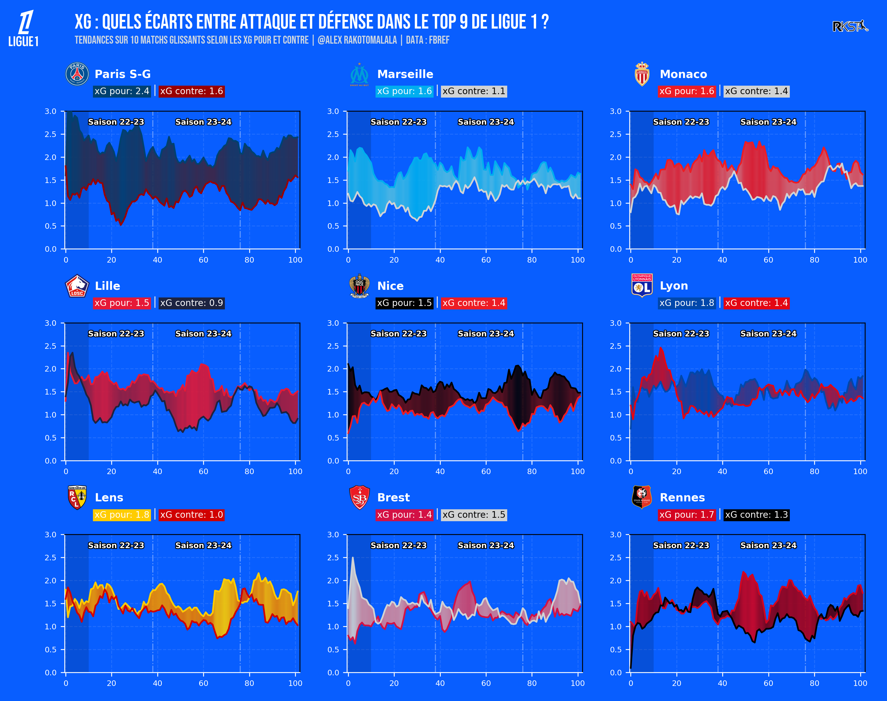

# xG Ligue 1 – Analyse des Écarts Attaque/Défense
# Visualisation des performances offensives et défensives (xG pour/contre) des équipes du Top 9 de Ligue 1 sur les trois dernières saisons.

# 📊 Objectif
Ce projet permet de :

Consolider les données de xG sur trois saisons (2022-2025)

Calculer des moyennes glissantes sur 10 matchs

Visualiser l’évolution xG en couleur dégradée selon l’écart attaque/défense

Comparer les performances des clubs du Top 9

# 🔧 Installation
pip install highlight_text adjustText fuzzywuzzy

# 📁 Données
Scores_and_Fixtures_Ligue_1_22_23.csv

Scores_and_Fixtures_Ligue_1_23_24.csv

Scores_and_Fixtures_Ligue_1_24_25.csv

# ▶️ Exécution
Lancer le script principal pour :

Nettoyer et transformer les données

Générer les graphes individuels et groupés

Exporter une image finale xG_Top9_Ligue1.png

# 📌 Dépendances
pandas, numpy, matplotlib, seaborn, PIL

bs4, requests (préparé mais non utilisé)

highlight_text, adjustText, fuzzywuzzy
